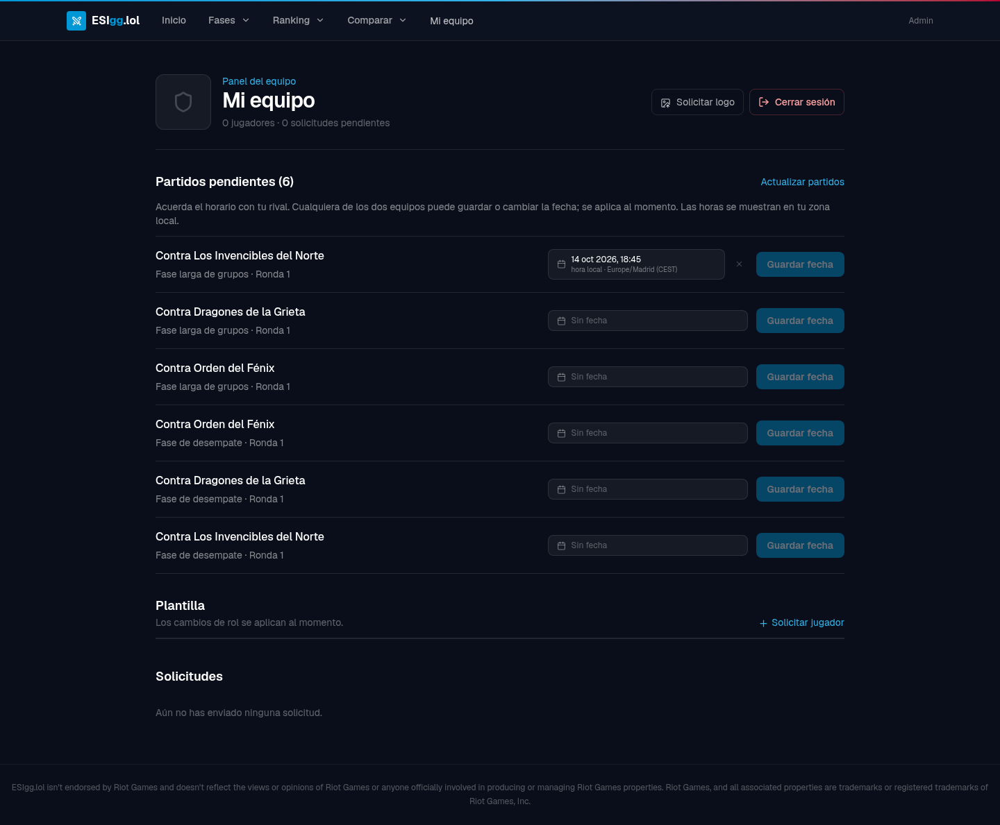
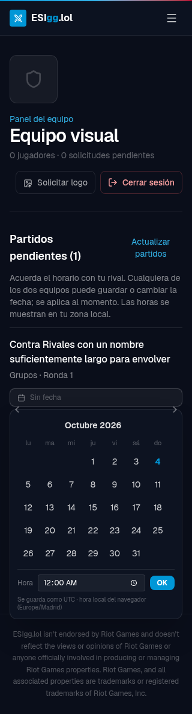

# Fechas de partidos desde el panel de equipos

En `/equipo`, cada equipo ve sus encuentros publicados sin resultado ni ganador y puede guardar, cambiar o quitar su fecha y hora. Cualquiera de los dos participantes puede modificar el horario acordado. El cambio se guarda directamente en el partido y se muestra en la zona horaria local del navegador.

La API toma el equipo y el torneo de la sesión, permite cambiar únicamente la fecha y exige la versión actual del partido. Rechaza equipos ajenos, sesiones revocadas, contenido no publicado, partidos finalizados y torneos archivados. Los datos enviados al panel no incluyen códigos de Riot ni tokens internos.

## Validación

- 15 pruebas relevantes de API, datos del portal y fechas: correctas.
- Dos recorridos completos de Playwright, LoL y Valorant, sobre el build final: correctos. Incluyen guardado, recarga, cambio, retirada de fecha, conflicto entre pestañas y desaparición de partidos finalizados.
- Auditoría adicional por tres agentes en Chromium con bases aisladas: acceso desde UI, varias fases y rivales repetidos, selección de fecha futura, actualización del listado público, edición desde el rival y rechazo de terceros. Un HTTP 500 conserva el borrador y permite reintentar.
- Vistas de 320, 390 y 768 px sin desbordamiento horizontal en los escenarios comprobados.
- Corregidos y comprobados de nuevo: excepción al vaciar la hora, cierre con Escape y devolución del foco, y contraste de las flechas del calendario compartido con administración.
- Lint, TypeScript, build y `git diff --check`: correctos. Sin dependencias nuevas ni migraciones.

La verificación de navegador usa Chromium y datos sintéticos en CT112. No incluye Safari, Firefox ni una certificación completa de accesibilidad. La pasada exploratoria de Valorant no completó el escenario de lista totalmente vacía; sí verificó la desaparición de un partido finalizado. No se ha desplegado en producción.

## Capturas

Panel de LoL con partidos de dos fases y rivales repetidos:

Calendario corregido a 320 px, con nombre largo de rival:

