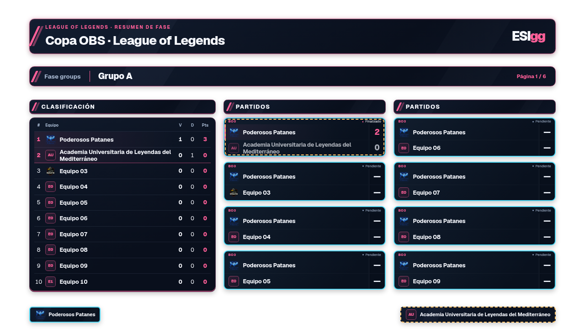
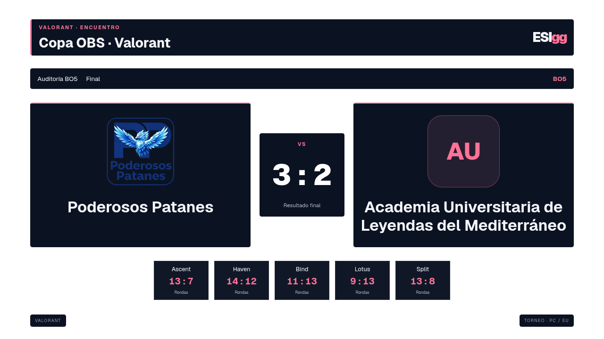

# Auditoría de overlays OBS — 28/09/2026

Tres subagentes revisaron LoL, Valorant y administración en CT112. Sus observaciones se contrastaron con capturas nuevas y una prueba completa del frontal, usando bases aisladas. Se conservó la selección del torneo de la previsualización compartida.

## Recorrido y resultado

1. **Configurar la emisión — correcto tras corregir la copia en HTTP.** Seleccionar, guardar, fijar fase/grupo/ronda/página, volver al seguimiento automático y cambiar entre dos torneos mantiene los datos independientes. Las casillas conservan las posiciones; los logos forman parte de lo esencial. [Panel](../capturas/lol-admin.png).
2. **Mostrar marcador y previa — correcto tras quitar el VS duplicado.** Nombres largos, logos ausentes, resultados, equipos pendientes y cinco mapas de Valorant caben en 1920×1080 y 1280×720. Los paneles conservan su fondo y el exterior es transparente. [Previa pendiente](../capturas/lol-previa-pending-1920.png), [BO5 con cinco mapas](valorant/1280x720-previa-bo5-5maps.png).
3. **Mostrar fases — clasificación corregida.** Antes, la segunda página de encuentros podía dejar únicamente las últimas filas del grupo. Ahora los grupos de hasta doce equipos aparecen completos en todas las páginas de partidos; los mayores se dividen en bloques de doce sin páginas de tabla vacías. Se verificaron grupos, suizo, eliminación, Final Four, Upper/Lower, tercer puesto y gran final. [Grupo completo](../capturas/lol-groups-1280.png), [página 2](../capturas/lol-auto-page-2.png), [Final Four](../capturas/lol-final-four-1280.png), [Upper/Lower](../capturas/valorant-upper-lower-1280.png).
4. **Actualizar fuentes abiertas — correcto.** Selección, resultado y retirada de publicación se reflejan en el siguiente refresco sin cambiar URL ni recargar el documento. Borrar el partido o retirar su publicación deja de mostrar sus datos; seleccionar contenido válido recupera la fuente.

## Criterio visual

Tras las comprobaciones del usuario, la vista inicial del suizo muestra todos los encuentros de todas las rondas publicadas, sin clasificación ni historiales separados. Los bordes cian continuo y ámbar discontinuo distinguen el recorrido de cada equipo seleccionado; sus cruces entre sí llevan ambas marcas. La revisión anterior comprobó que la tabla cabía, pero no detectó que esa vista inicial no correspondía a lo previsto para suizo. Grupos conserva clasificación y partidos; mostrar clasificación en suizo requiere elegirlo expresamente. Véase la [captura vigente del suizo completo](../recorridos/valorant-paths-swiss-1920.png).

Se mantiene un diseño sencillo: fondos solo en componentes, colores cian/rosa por juego, nombres y resultados prioritarios, títulos y metadatos opcionales. Las zonas vacías al ocultar elementos son intencionadas para conservar su posición en la escena de OBS.

No se observaron solapamientos ni desbordamientos en los casos revisados. A 720p los metadatos pequeños tienen menos margen de lectura; conviene mantenerlos ocultos si no aportan información a la emisión. Las tablas de más de doce equipos requieren paginación, no una reducción general del texto.

## Evidencia y límites

- [LoL](lol.md), [Valorant](valorant.md), [administración](admin.md).
- 56 capturas de la matriz: dos juegos y dos resoluciones; 54 fuentes con alfa 0 exterior y píxeles opacos en los componentes, más dos capturas de administración.
- Regresiones automatizadas de clasificación, configuración, autorización, publicación, aislamiento, modos visibles, geometría estable y copia sin Clipboard API.
- No es una certificación de accesibilidad completa ni una prueba dentro de OBS. Falta validar la lectura tras compresión y escalado en una emisión real. No se ha publicado ni desplegado en producción.
